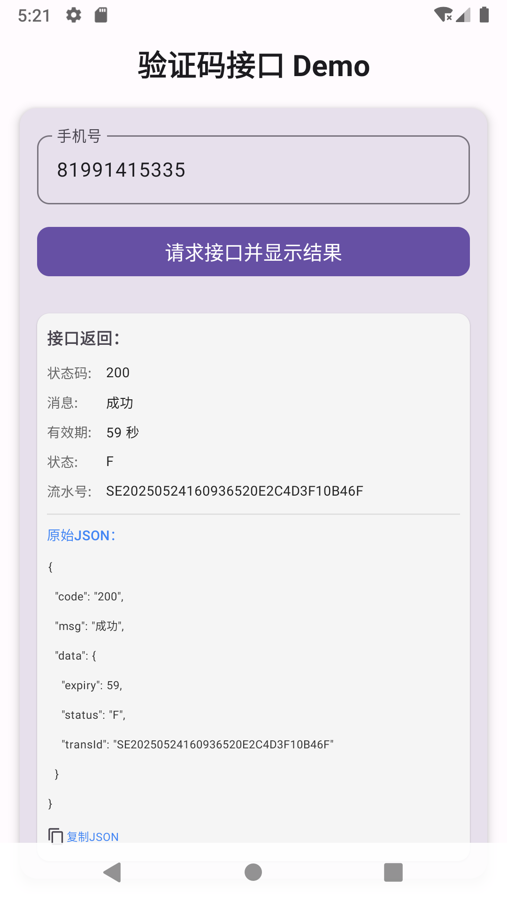

# 验证码接口 Demo App



## 项目简介

本项目是一个基于 **Jetpack Compose** + **MVI 架构** 的 Android Demo App，主要演示了如何优雅地调用加密接口、解密并格式化展示结果，适合现代Android开发的最佳实践参考。

## 技术栈
- **Jetpack Compose**：声明式UI开发，代码简洁、响应式强。
- **MVI 架构**：意图(Intent)、状态(State)、单向数据流，UI与业务彻底解耦。
- **Kotlin**：全代码Kotlin实现，类型安全。
- **Retrofit + OkHttp**：网络请求，支持自动加解密。
- **自定义AesConverterFactory**：Retrofit自动加解密与Gson序列化。
- **数据类Bean**：接口参数/响应全类型安全，支持多字段名兼容。

## 主要功能
- 输入手机号，一键请求验证码接口。
- 所有接口参数、响应均自动AES加解密，安全合规。
- 结果分为结构化字段展示和原始JSON格式化展示，支持一键复制JSON。
- UI美观，适配移动端，支持内容滚动。
- 详细日志，便于调试和排查。

## 架构说明
- **ViewModel**：负责状态管理和业务逻辑，暴露State流。
- **Intent**：用户操作意图，驱动业务流转。
- **Repository**：数据仓库，封装网络请求和数据处理。
- **Compose UI**：只负责渲染，完全无业务逻辑。
- **Activity**：仅负责setContent，UI与业务彻底分离。

## 运行截图
见上方图片，界面简洁，数据展示清晰。

## 快速体验
1. 克隆本项目：
   ```bash
   git clone https://github.com/zhongtoufeijiless/mbjmb.git
   ```
2. 用 Android Studio 打开，直接运行。
3. 或安装根目录下 `app-release-signed.apk` 到设备/模拟器。

## 适用场景
- 现代Android Compose项目的MVI最佳实践参考
- 需要接口加解密、类型安全、自动化数据流的业务场景
- 需要美观、可维护、易扩展的App开发模板

---
如需定制或有更多问题，欢迎联系作者。
